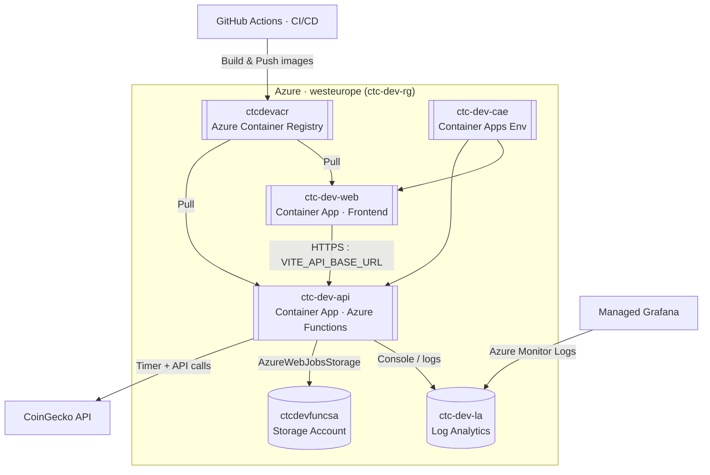
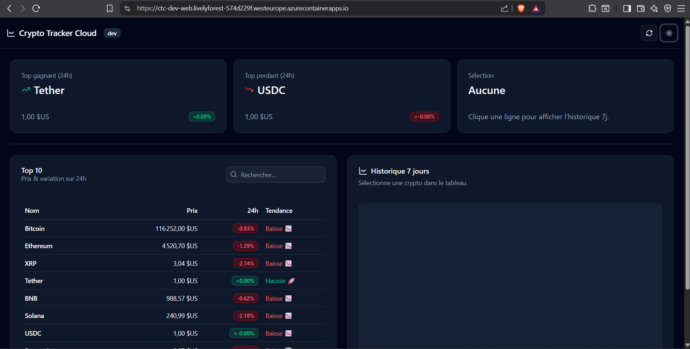
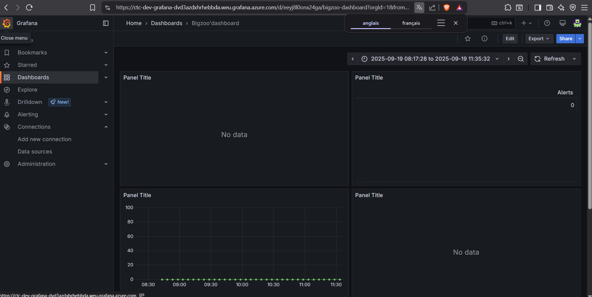
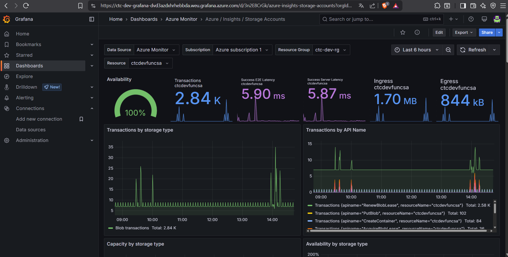

# Crypto Tracker Cloud — Terraform • Docker • Azure Container Apps

**Demo :** [https://ctc-dev-web.livelyforest-574d229f.westeurope.azurecontainerapps.io/](https://ctc-dev-web.livelyforest-574d229f.westeurope.azurecontainerapps.io/)

Application cloud de suivi des cryptomonnaies (Top 10, variations 24h, historique 7j), déployée **100% Docker** sur **Azure Container Apps** via **Terraform** et **GitHub Actions**. Observabilité avec **Log Analytics** + **Grafana**.

---

## ✨ Vue d’ensemble

* **Infra as Code :** Terraform modulaire (réutilisable, lisible, idempotent).
* **Runtime :** Backend **Azure Functions (Node/TS)** en conteneur, Front **Vite/React/TS** en conteneur.
* **Déploiement :** Build Docker → push **ACR** → update **Azure Container Apps** (dev).
* **Monitoring :** Logs et requêtes KQL dans **Log Analytics**, dashboards **Grafana**.
* **CI/CD :** GitHub Actions (CI pour build/tests, CD pour build/push/deploy).
* **Lien Front ↔ Back :** `VITE_API_BASE_URL` injectée au build du front (par le CD).

---

## 🏗️ Infrastructure (Terraform)

**Modules maison :**

* `rg` — Resource Group
* `log_analytics` — Log Analytics Workspace
* `storage` — Storage Account (Functions runtime / state local pour le dev)
* `acr` — Azure Container Registry
* `container_apps_env` — Azure Container Apps Environment
* `container_app_backend` — Container App API (image Functions)
* `container_app_frontend` — Container App Web (image NGINX)

**Pourquoi Terraform (ici) ?**

* **Modularité** (modules isolés, variables/outputs)
* **Reproductibilité** (mêmes recettes pour dev/stg/prd)
* **Traçabilité** (code review/PR)
* **Idempotence** (plan/apply contrôlés)

**Commande type :**

```bash
cd infra
terraform init
terraform plan -var-file="environments/dev.tfvars"
terraform apply -var-file="environments/dev.tfvars"
```

> *Amélioration ultérieure :* basculer le **state Terraform** en backend distant (Storage + blob lock) et intégrer Key Vault pour secrets.


Yes 👌 Tu as 3 façons simples d’obtenir l’**image d’architecture** :

---

## Option 1 — Depuis **Azure Portal** (capture du “Resource visualizer”)

1. Portal → **Groupes de ressources** → **ctc-dev-rg**
2. Menu gauche → **Resource visualizer** (ou “Visualiseur de ressources”).
3. Clique sur un nœud (ex. *ctc-dev-cae*) pour faire apparaître les relations, zoome/dézoome.
4. **Prends une capture** (Windows: `Win+Shift+S`) → enregistre-la comme `docs/images/architecture.png`.

> C’est le moyen le plus “officiel Azure” et rapide pour un screenshot propre de **ce qui existe vraiment** dans ton RG.

Schema terraform : 



---

## 🧰 Backend — Azure Functions (Node/TypeScript)

**Endpoints :**

* `GET /api/cryptos` → top 10 (prix, variation 24h, tendance)
* `GET /api/history/:id` → historique prix **7 jours**
* **Timer Function** `ingestTimer` → toutes les X minutes

  * Récupère le top 10 CoinGecko
  * Loggue un événement si **chute ≤ -5%** sur 24h
  * Exemple de log métier :
    `ALERT_DROP_5PCT {"id":"bitcoin","change24h":-6.12,"at":"2025-...Z"}`
  * Ces logs alimentent **Log Analytics → Grafana** (alerting/graph)

**Docker :**

* Image build multi-stage (Node → Functions base image)
* Exposition Container Apps via ingress (HTTPS managé ACA)

---

## 🖥️ Frontend — Vite/React/TS + shadcn/ui (dark)

* Tableau **Top 10** + **recherche** + badges variation
* **Graphique Recharts** (historique 7j) sur sélection d’une crypto
* **Mode sombre** + UI shadcn (cards, table, skeletons, alerts)
* URL API configurable : **`VITE_API_BASE_URL`** (injectée au build par le CD)

---

## 🚀 CI/CD — GitHub Actions

### CI (`.github/workflows/ci.yml`)

* **Backend & Frontend :** `npm ci` → `tsc` → tests (sanity `1+1=2`) → `npm run build`
* **Docker build (sanity)** pour chaque app

### CD dev (`.github/workflows/cd-dev.yml`, déclenché sur `main`)

1. **Docker login** ACR
2. **Build & push** images :

   * back → `${ACR}/ctc-backend:${GITHUB_SHA}`
   * front → `${ACR}/ctc-frontend:${GITHUB_SHA}` (avec `--build-arg VITE_API_BASE_URL=${{ vars.DEV_API_BASE_URL }}`)
3. **Update Container Apps** (backend & frontend) → nouvelle révision avec l’image taggée SHA

**Secrets/vars utilisés :**

* `AZURE_CREDENTIALS` (Service Principal scope RG)
* `ACR_LOGIN_SERVER`, `ACR_USERNAME`, `ACR_PASSWORD`
* `DEV_API_BASE_URL` (Repository Variable)

---

## 📈 Monitoring & Alerting

**Data path :**

* Logs Functions → **Container Apps** → **Log Analytics (ctc-dev-la)**
* **Grafana managé** lit **Azure Monitor / Logs** (datasource) et affiche des panneaux :

  * Activité console (timer ticks, erreurs)
  * “Alertes métier” : occurrences `ALERT_DROP_5PCT`

**Exemples KQL (Log Analytics / Grafana)**

> Comptage des logs “timer” (courbe, 5 min) :

```kusto
let app = "ctc-dev-api";
let bins = range t from ago(6h) to now() step 5m;
let c =
  ContainerAppConsoleLogs_CL
  | where ContainerAppName_s == app
  | summarize Logs = count() by bin(TimeGenerated, 5m);
bins
| join kind=leftouter c on $left.t == $right.TimeGenerated
| extend TimeGenerated = t, Logs = coalesce(Logs, 0)
| project TimeGenerated, Logs
| order by TimeGenerated asc
```

> Alertes “chute > 5%” (table ou stat) :

```kusto
ContainerAppConsoleLogs_CL
| where ContainerAppName_s == "ctc-dev-api"
| where Log_s has "ALERT_DROP_5PCT"
| project TimeGenerated, Log_s
| order by TimeGenerated desc
```

**Règles d’alertes (Azure Monitor) :**

* **Métier :** si `ALERT_DROP_5PCT` > 0 sur 5 min → mail (Action Group)
* **Santé :** “no logs 10 min” → signal d’indisponibilité

---

## 🐳 Docker partout

* **Backend** : image Functions (Node 20) + dist + `node_modules`
* **Frontend** : build Vite → **NGINX** statique
* **Registry** : **ACR** (admin credentials pour le POC)
* **Run** : **Azure Container Apps** (ingress managé, révisions)

---

## 🧪 Tests (sanity)

* Backend & Frontend : test minimal `1 + 1 = 2` (preuve de pipeline & setup test).

---

## 🛠️ Dev local (facile)

* **Backend local :** Azure Functions Core Tools + **Azurite**

  * `backend/local.settings.json` → `AzureWebJobsStorage=UseDevelopmentStorage=true`
  * `npm run dev` (watch + `func start` sur `http://localhost:7071`)
* **Frontend local :**

  * `frontend/.env.local` → `VITE_API_BASE_URL=http://localhost:7071`
  * `npm run dev` (Vite)

---

## 🖼️ Screenshots (à ajouter)

* **Dashboard Web** (table + graphe 7j)
  

* **Grafana** (panneaux Logs & Alertes)
  
  

* **Architecture Azure (Terraform)**
  ``

---

## 📂 Structure du repo (simplifiée)

```
infra/
  main.tf, variables.tf, outputs.tf
  modules/
    rg/                 # resource group
    log_analytics/      # workspace LA
    storage/            # storage account
    acr/                # container registry
    container_apps_env/ # env ACA
    container_app_backend/   # app API (image)
    container_app_frontend/  # app Web (image)
backend/
  src/cryptos/...
  src/history/...
  src/ingestTimer/...   # timer > logs métier
  Dockerfile
  tests/
frontend/
  src/App.tsx (shadcn + Recharts)
  Dockerfile
  tests/
.github/workflows/
  ci.yml
  cd-dev.yml
docs/
  README.md (ce fichier)
```

---

## 🔚 Bilan / points forts DevOps

* **Infra modulaire** Terraform → reproductible, lisible, évolutive
* **Conteneurisation complète** (builds déterministes, déploiements rapides)
* **CI/CD simple et efficace** (SHA tags, zéro downtime via révisions ACA)
* **Observabilité pragmatique** (Logs → KQL → Grafana, alertes métier et santé)
* **Paramétrage propre** (`VITE_API_BASE_URL` injectée par l’usine logicielle)
